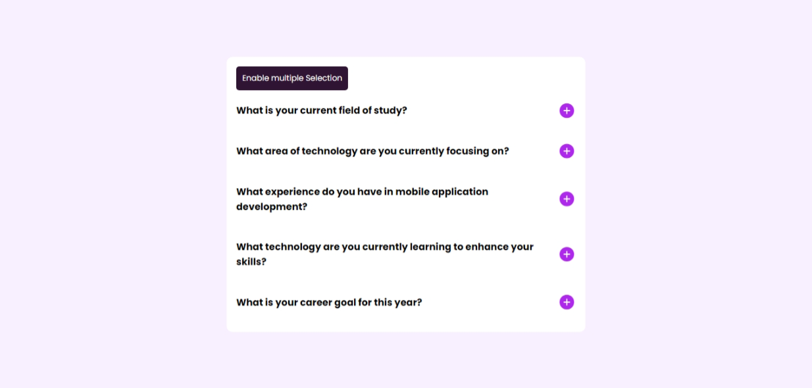

# My Beginner React Projects

A collection of my beginner React projects to practice and showcase my skills.

## Projects Overview

##### **Accordion**



- **Live Demo:** [Live Link](https://MahmoodHashem.github.io/beginner-react-projects/accordion)
- **Repo:** [Repository](https://github.com/MahmoodHashem/beginner-react-projects/tree/main/accordion)

## How to Use This Repository

1. Clone the repository:
   ```bash
   git clone https://github.com/MahmoodHashem/beginner-react-projects.git
   ```
2. Navigate to the desired project directory:
   ```bash
   cd beginner-react-projects
   cd desired-project-name
   ```
3. Install dependencies:
   ```bash
   npm install
   ```
4. Start the Project
   ```bash
   npm run dev
   ```
