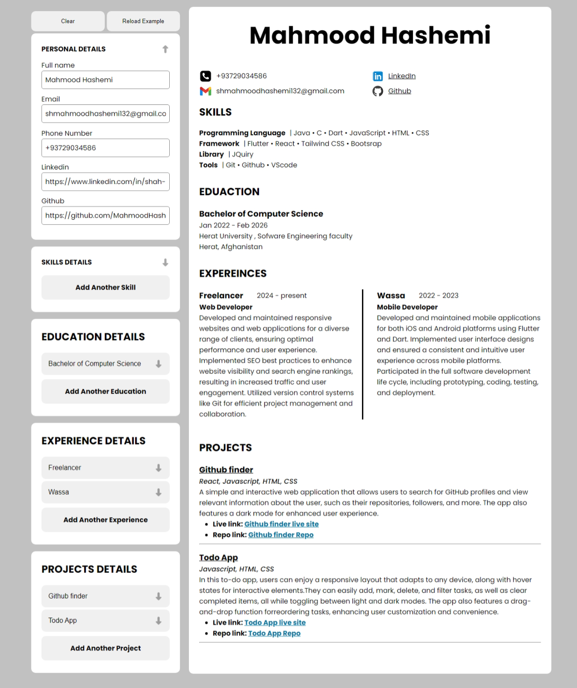

# Developer CV Maker

A web application designed to help users especially Developers create and manage their professional CVs easily. The app allows users to input personal details, education, skills, work experience, and projects, all organized into collapsible sections for a clean and user-friendly interface.

## Screenshot

## Table of Contents

- [Features](#features)
- [Link](#link)
- [Technologies Used](#technologies-used)
- [What I Learned](#what-i-learned)
- [JavaScript Version](#javascript-version)

## Features

- **Dynamic Forms**: Add or remove sections for education, skills, experiences, and projects dynamically.
- **Collapsible Sections**: Collapse or expand form sections to manage space and improve usability.
- **Controlled Components**: All form inputs are controlled components, ensuring real-time state updates.
- **User-Friendly Interface**: Intuitive layout for easy navigation and data entry.
- **Responsive Design**: Adapts well to different screen sizes for mobile and desktop users.

## Link

[Live site](https://dev-cv-maker.vercel.app/)

## Technologies Used

- **React**: JavaScript framework for building user interfaces.
- **JavaScript**: Programming language used for creating interactive web applications.
- **HTML & CSS**: Markup and styling languages for structuring and designing the app.

## What I Learned

- How to manage complex state in React using hooks like `useState`, particularly in dynamic scenarios involving nested structures (object → array → object).
- Techniques for handling dynamic forms, including adding and removing inputs.
- Best practices for creating controlled components and handling user input.
- Implementing collapsible UI components for enhanced user experience.
- The importance of structuring components for maintainability and readability.
- Fundamental concepts of React, including event handling and conditional rendering.
