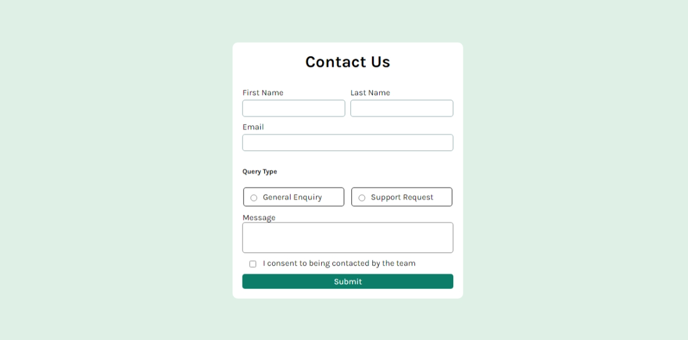

# Contact Form

This React application is a contact form that allows users to submit inquiries. It collects user information such as their first name, last name, email, query type, message, and consent. The form is designed with accessibility and usability in mind, ensuring a smooth user experience.

## Screenshot

## Table of Contents

- [Features](#features)
- [Link](#links)
- [Technologies Used](#technologies-used)
- [What I Learned](#what-i-learned)
- [JavaScript Version](#javascript-version)

## Features

* **User Input Fields**: Collects first name, last name, email, message, and query type through various input types (text, radio, textarea, checkbox).
* **Controlled Components**: Uses controlled components for managing form inputs, ensuring the component state is always in sync with the input fields.
* **Dynamic Input Handling**: A single function handles changes for all input types, simplifying the codebase.
* **Form Validation**: Uses the `required` attribute on inputs to enforce basic validation before submission.
* **Responsive Layout**: The form is styled for a user-friendly experience across different devices.

## Link

[Live site](https://contact-form-vert-phi.vercel.app/)

## Technologies Used

* **React**: For building the user interface and managing component state.
* **JavaScript**: For implementing the form logic and handling user interactions.
* **CSS**: For styling the form and ensuring a responsive design.
* **React Hooks**: Utilizes `useState` for state management and `useId` for generating unique IDs for inputs.

## What I Learned

* **Controlled Components**: Gained experience in managing form inputs as controlled components, leading to cleaner and more maintainable code.
* **Dynamic State Management**: Learned how to handle multiple form inputs using a single state object and change handler.
* **Event Handling**: Practiced event handling in React, particularly how to prevent default form submission behavior.
* **Form Validation Techniques**: Learned about using HTML attributes for client-side validation to enhance user experience.

This project deepened my understanding of React forms and best practices, providing a solid foundation for building more complex user interfaces in the future.

## JavaScript Version

In addition to the React version, there is a plain [JavaScript version](https://github.com/MahmoodHashem/Mentor-Challanges/tree/main/contact-form) of the contact form. This version demonstrates how to implement the same functionality without using React. It provides a useful reference for understanding the underlying logic and structure.
