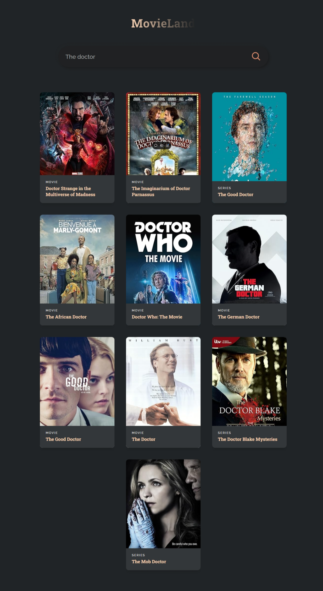

# MovieLand

A React application that allows users to search for movies using the OMDB API. Users can enter a movie title, and the app will display relevant movie details, including the title, year, and poster.

## Screenshot

## Table of Contents

- [Features](#features)
- [Link](#link)
- [Technologies Used](#technologies-used)
- [What I Learned](#what-i-learned)

## Features

- **Search Functionality**: Users can search for movies by title.
- **Dynamic Movie Display**: The app fetches and displays a list of movies based on the user's search input.
- **Error Handling**: If no movies are found, a message is displayed.
- **Responsive Design**: The application is designed to work well on different screen sizes.

## Link

[Live site](https://movie-land-teal.vercel.app/)

## Technologies Used

- **React**: For building the user interface and managing application state.
- **JavaScript (ES6+)**: For implementing the app’s logic and functionality.
- **HTML/CSS**: For structuring and styling the application.
- **OMDB API**: To fetch movie data based on user input.

## What I Learned

- **Asynchronous Data Fetching**: Implemented asynchronous functions to fetch data from an external API, understanding how to handle promises and responses.
- **Conditional Rendering**: Practiced rendering different UI elements based on the state (e.g., displaying a message when no movies are found).
