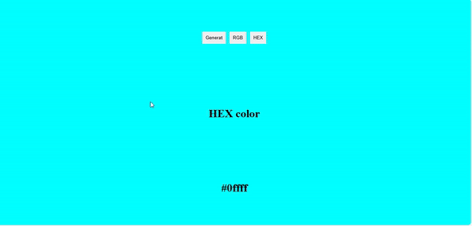

# Random Color Generator

This app generates random RGB colors and displays them in both RGB and HEX formats. Users can click a button to generate a new color, and toggle between viewing the color values in RGB or HEX format. The background color of the app changes dynamically based on the generated color, providing a visual representation of the selected color.

## Screenshot

## Table of Contents

- [Features](#features)
- [Technologies Used](#technologies-used)
- [What I Learned](#what-i-learned)

## Features

* **Random Color Generation**: Generate random RGB colors with the click of a button.
* **Display Formats**: Toggle between RGB and HEX formats to view the current color values.
* **Dynamic Background**: The app's background color changes dynamically to reflect the generated RGB color.

## Technologies Used

* **React**: For building the user interface.
* **CSS**: For styling the application and ensuring a visually appealing layout.
* **JavaScript**: For generating random colors and managing application logic.

## What I Learned

* **Dynamic Styles**: Implemented inline styles in React to dynamically change the background color based on the application state.
* **Complex State Updates** : I managed an object as state (`color`), which showcases how to handle complex state structures in React. This is useful for grouping related data together.
