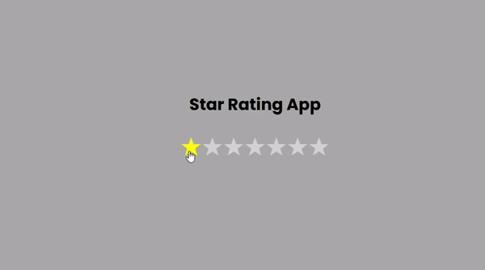

# Star Rating App

This project is a star rating application that allows users to rate items using a visual star interface. Users can hover over the stars to see their rating dynamically change, and they can click on a star to set their final rating. The app features a customizable number of stars, making it versatile for various use cases.

## Screenshot

 

## Table of Contents

- [Features](#features)
- [Technologies Used](#technologies-used)
- [What I Learned](#what-i-learned)

## Features

* **Interactive Star Rating**: Users can hover over stars to preview their rating and click to select their rating.
* **Customizable Stars**: The total number of stars displayed can be easily adjusted.
* **Dynamic Feedback**: Immediate visual feedback is provided as users interact with the star rating system.

## Technologies Used

* **React**: For building the user interface and managing component state.
* **CSS**: For styling the stars and ensuring a user-friendly layout.
* **JavaScript**: For implementing the logic behind the rating system and handling user interactions.

## What I Learned

* **Event Handling**: Improved skills in handling mouse events to create a responsive user interface.
* **Dynamic Rendering**: Practiced using conditional rendering to visually represent different states (hovering vs. clicked).
* **State Synchronization**: The distinction between `hoverRate` and `rating` taught me how to manage multiple states that control the same UI element, ensuring that the visual feedback is intuitive and responsive.
* **Creating Arrays**: Learned how to create an array using `[...Array(totalStars)].map`, which is a concise way to generate a list of elements in React.
